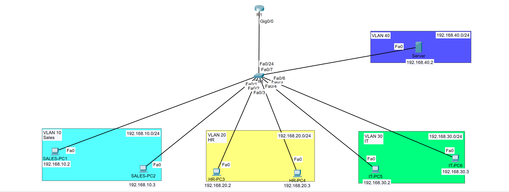

# ACL Network Security Lab

## Overview

This lab demonstrates the use of extended Access Control Lists (ACLs) to control traffic between departments in a segmented enterprise network.

The network contains separate VLANs for Sales, HR, IT, and server resources. Inter-VLAN routing provides connectivity between the networks, while an extended ACL enforces departmental access restrictions.

## Topology



### Network Segments

| VLAN | Department | Network |
|---|---|---|
| VLAN 10 | Sales | 192.168.10.0/24 |
| VLAN 20 | HR | 192.168.20.0/24 |
| VLAN 30 | IT | 192.168.30.0/24 |
| VLAN 40 | Server | 192.168.40.0/24 |

## Objectives

- Segment departments using VLANs
- Provide inter-VLAN routing between networks
- Configure an extended IPv4 ACL
- Restrict traffic between selected departments
- Preserve required connectivity to other network resources
- Apply the ACL to the appropriate router interface and direction
- Verify permitted and denied traffic
- Troubleshoot ACL behavior and network connectivity

## Technologies

- Cisco IOS
- VLANs
- 802.1Q trunking
- Inter-VLAN routing
- IPv4
- Extended Access Control Lists
- Traffic filtering
- Network segmentation

## Security Policy

The ACL was designed to prevent hosts on the HR network (`192.168.20.0/24`) from accessing the Sales network (`192.168.10.0/24`) while allowing HR to retain required connectivity to other permitted networks.

This demonstrates how ACLs can enforce communication policies between departments without completely isolating a network.

## ACL Implementation

An extended ACL was configured on the router to identify both the source and destination networks.

The primary restriction was:

```text
Source:       192.168.20.0/24 (HR)
Destination:  192.168.10.0/24 (Sales)
Action:       DENY
```

Other permitted traffic was allowed to continue according to the configured policy.

The ACL was applied inbound on the HR-facing routed interface so unwanted traffic could be filtered close to its source.

## Verification

ACL configuration and interface placement can be verified with Cisco IOS commands such as:

```text
show access-lists
show ip access-lists
show ip interface
show running-config
show ip interface brief
```

End-to-end testing was also performed from client workstations.

Expected behavior included:

```text
HR -> Sales       DENIED
HR -> IT          PERMITTED
HR -> Server      PERMITTED
```

Testing both permitted and denied traffic verifies that the ACL restricts only the intended communication rather than unintentionally disrupting other network access.

## Skills Demonstrated

- Extended ACL configuration
- Source and destination traffic filtering
- ACL interface placement
- Inbound traffic filtering
- VLAN segmentation
- Inter-VLAN routing
- Cisco IOS configuration
- Security policy implementation
- Connectivity verification
- Network troubleshooting


## Lab File

The Cisco Packet Tracer topology is included in this directory:

`VLAN Segmentation ACLs.pkt`