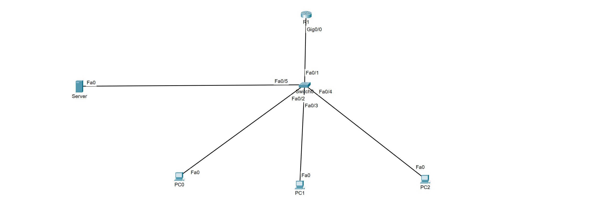

# DHCP & DNS Services Lab

## Overview

This lab demonstrates centralized DHCP and DNS services in a Cisco Packet Tracer network.

A server provides network services to multiple client workstations connected through a Layer 2 switch, while a router provides the network's default gateway.

## Topology



### Devices

- 1 Cisco router
- 1 Cisco switch
- 1 network services server
- 3 client workstations

## Objectives

- Configure centralized DHCP services
- Automatically assign IP configuration to client devices
- Configure DNS services and hostname resolution
- Configure client systems to obtain addressing through DHCP
- Verify network connectivity
- Verify DNS name resolution
- Troubleshoot client addressing and network services

## Technologies

- DHCP
- DNS
- IPv4
- Cisco IOS
- Ethernet switching
- Client/server networking
- Default gateway configuration

## Implementation

The network uses a centralized server to provide DHCP and DNS services to client workstations.

DHCP was configured to dynamically provide client devices with the required network configuration, reducing the need to manually configure addressing on each workstation.

DNS services were configured to provide name resolution, allowing clients to reach network resources using hostnames rather than relying solely on IP addresses.

The router provides Layer 3 gateway connectivity while the switch provides Layer 2 connectivity between the server, router, and client devices.

## Verification

DHCP operation can be verified from each workstation by confirming that the client receives its network configuration dynamically.

Connectivity and DNS resolution can then be tested from the client command prompt.

Useful tests include:

```text
ipconfig
ping <default-gateway>
ping <server-ip>
ping <configured-hostname>
```

Router verification can also be performed with:

```text
show ip interface brief
show running-config
```

## Skills Demonstrated

- DHCP configuration
- DNS configuration
- Dynamic IPv4 addressing
- Client/server network services
- Default gateway configuration
- Network connectivity testing
- DNS resolution testing
- Basic Cisco IOS verification
- Network troubleshooting

## Lab File

The Cisco Packet Tracer topology is included in this directory:

`DHCP and DNS Services.pkt`