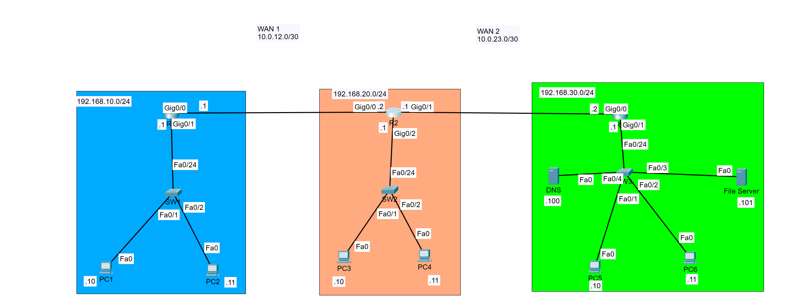
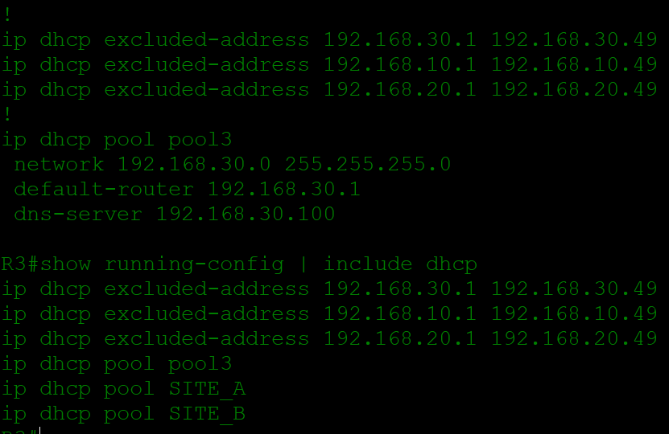

# Enterprise Network Infrastructure Capstone

## Overview

This capstone project demonstrates the design, configuration, and verification of a multi-site enterprise network using Cisco IOS and Cisco Packet Tracer.

The network consists of three LANs connected across point-to-point WAN links. It combines dynamic routing, centralized DHCP and DNS services, DHCP relay, access control, secure remote administration, NTP, and centralized file services into a single working environment.

Rather than demonstrating each technology independently, this project integrates multiple networking concepts into one end-to-end infrastructure design.

## Network Topology



The topology contains three routed sites connected through R1, R2, and R3.

### LAN Addressing

| Site | Network | Gateway |
|---|---|---|
| Site A | 192.168.10.0/24 | 192.168.10.1 |
| Site B | 192.168.20.0/24 | 192.168.20.1 |
| Site C / Services | 192.168.30.0/24 | 192.168.30.1 |

### WAN Addressing

| Connection | Network |
|---|---|
| R1 ↔ R2 | 10.0.12.0/30 |
| R2 ↔ R3 | 10.0.23.0/30 |

### Centralized Services

| Service | Address |
|---|---|
| DNS / NTP Server | 192.168.30.100 |
| File Server | 192.168.30.101 |

## Technologies Implemented

- Cisco IOS
- IPv4 addressing and subnetting
- OSPF dynamic routing
- Point-to-point WAN networking
- DHCP
- DHCP relay
- DNS
- NTP
- Extended Access Control Lists
- SSH remote administration
- Centralized file services
- Routing table analysis
- Network troubleshooting and verification

---

## OSPF Dynamic Routing

OSPF provides dynamic routing between the three sites.

The routers exchange information about their connected LAN and WAN networks, eliminating the need to manually maintain static routes between each site.

R2 serves as the transit router between R1 and R3.

OSPF verification confirmed that R2 established full neighbor relationships with both adjacent routers.


The R2 routing table contains dynamically learned OSPF routes including:

```text
192.168.10.0/24 via 10.0.12.1
192.168.30.0/24 via 10.0.23.2
```

Both remote LAN routes appear with the `O` route code, confirming that they were learned through OSPF.

The `[110/2]` values shown in the routing table indicate an OSPF administrative distance of 110 and a route metric of 2.

Useful verification commands include:

```text
show ip ospf neighbor
show ip route
show ip protocols
show ip interface brief
```

---

## Centralized DHCP

R3 provides centralized DHCP services for the network.

DHCP pools were configured for the three LAN environments:

```text
SITE_A
SITE_B
pool3
```

Addresses `.1` through `.49` were excluded from dynamic allocation on each LAN:

```text
192.168.10.1 - 192.168.10.49
192.168.20.1 - 192.168.20.49
192.168.30.1 - 192.168.30.49
```

This reserves lower address ranges for gateways, servers, infrastructure devices, and other systems requiring static addressing.



The Site C DHCP pool shown in the configuration uses:

```text
Network:         192.168.30.0/24
Default Gateway: 192.168.30.1
DNS Server:      192.168.30.100
```

---

## DHCP Relay

Because DHCP clients exist on networks separated from the DHCP service by routers, DHCP relay is used to forward the required broadcast traffic across routed boundaries.

For example, R1's Site A LAN interface is configured with an `ip helper-address`.


The configuration demonstrates how DHCP requests originating from the `192.168.10.0/24` LAN can be relayed toward the centralized DHCP service rather than requiring an independent DHCP server at every site.

This demonstrates the use of centralized infrastructure services across multiple routed networks.

---

## DNS and Network Services

A centralized server at:

```text
192.168.30.100
```

provides DNS services to network clients.

The DHCP configuration distributes this address to clients as their DNS server:

```text
dns-server 192.168.30.100
```

This allows client DNS configuration to be centrally distributed through DHCP rather than manually configured on each endpoint.

The same server address is also referenced by network devices for NTP.

---

## Network Time Protocol

Network devices are configured to reference the centralized server at `192.168.30.100` for time synchronization.

Example configuration:

```text
ntp server 192.168.30.100
```

Centralized time synchronization is important for maintaining consistent timestamps across infrastructure devices and supporting accurate event logging and troubleshooting.

---

## Access Control Lists

An extended ACL is used to enforce traffic policy between user networks and the centralized file server.

ACL 110 contains rules preventing FTP traffic from Site A and Site B from reaching the file server at:

```text
192.168.30.101
```

The configuration includes:

```text
access-list 110 deny tcp 192.168.10.0 0.0.0.255 host 192.168.30.101 eq ftp
access-list 110 deny tcp 192.168.20.0 0.0.0.255 host 192.168.30.101 eq ftp
access-list 110 permit ip any any
```

This demonstrates selective traffic filtering rather than completely isolating the networks.

FTP traffic matching the deny statements is restricted while other permitted IP traffic can continue through the router.

---

## Secure Remote Administration

Remote Cisco IOS administration is restricted to SSH.

The VTY configuration includes:

```text
line vty 0 4
 login local
 transport input ssh
```

This requires local authentication and permits SSH as the remote access protocol.

Using SSH provides encrypted remote management instead of relying on insecure plaintext remote administration protocols.

---

## Security and Services Verification


The CLI verification demonstrates several configurations operating within the capstone environment, including:

- Extended ACL 110
- FTP traffic restrictions
- Local VTY authentication
- SSH-only remote access
- Centralized NTP configuration

---

## Verification and Troubleshooting

The completed network was validated using Cisco IOS diagnostic and verification commands.

Examples include:

```text
show ip route
show ip ospf neighbor
show ip protocols
show ip interface brief
show running-config
show access-lists
show ip dhcp binding
show ip dhcp pool
ping
traceroute
```

These commands can be used to verify routing, neighbor relationships, addressing, DHCP operation, access policies, and end-to-end connectivity.

Troubleshooting involved validating the network layer by layer, including:

1. Physical and interface status
2. IPv4 addressing
3. Local gateway connectivity
4. WAN connectivity
5. OSPF neighbor relationships
6. Routing table population
7. DHCP and relay configuration
8. DNS configuration
9. ACL behavior
10. Remote management configuration

---

## Skills Demonstrated

This project demonstrates practical experience with:

- Enterprise network design
- Cisco IOS configuration
- IPv4 addressing
- Subnetting
- `/30` point-to-point WAN design
- OSPF configuration and verification
- Dynamic route analysis
- DHCP server configuration
- DHCP relay
- DNS integration
- Extended ACL configuration
- Traffic filtering
- SSH administration
- NTP configuration
- Centralized network services
- Cisco IOS show commands
- Ping and traceroute
- End-to-end network troubleshooting
- Technical documentation

---

## Project Architecture

The overall traffic flow can be summarized as:

```text
Site A                    Site B                    Site C
192.168.10.0/24           192.168.20.0/24           192.168.30.0/24

Clients                    Clients                   Clients
   |                          |                         |
  SW1                        SW2                       SW3
   |                          |                         |
  R1 -------- WAN 1 -------- R2 -------- WAN 2 -------- R3
        10.0.12.0/30               10.0.23.0/30         |
                                                        |
                                              +---------+---------+
                                              |                   |
                                          DNS / NTP           File Server
                                       192.168.30.100       192.168.30.101
```

OSPF provides routing between the sites while centralized infrastructure services are hosted within the Site C network.

---

## Verification Evidence

The repository includes screenshots documenting the completed network:

- `topology.png` — complete enterprise topology
- `ospf-verification.png` — OSPF neighbors and dynamically learned routes
- `dhcp-relay-verification.png` — remote-site DHCP relay configuration
- `dhcp-server-verification.png` — centralized DHCP pools and exclusions
- `security-services-verification.png` — ACL, SSH, and NTP configuration

These screenshots provide configuration and operational evidence in addition to the Packet Tracer topology itself.

---

## Lab File

The complete Cisco Packet Tracer project is included in this directory:

`Enterprise WAN.pkt`