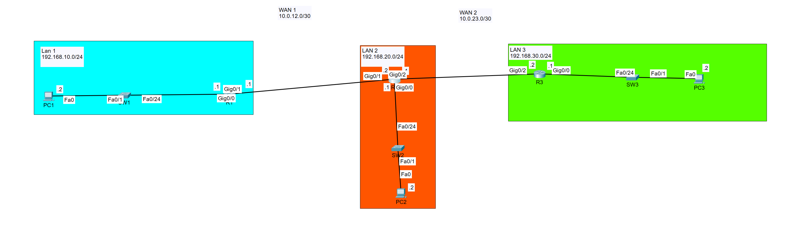

# OSPF WAN Routing Lab

## Overview

This lab demonstrates dynamic routing between three separate LANs connected across point-to-point WAN links.

Three Cisco routers use OSPF to dynamically exchange routing information, allowing hosts on each LAN to communicate without manually configuring static routes for every remote network.

## Topology



### LAN Networks

| Site | Network |
|---|---|
| LAN 1 | 192.168.10.0/24 |
| LAN 2 | 192.168.20.0/24 |
| LAN 3 | 192.168.30.0/24 |

### WAN Networks

| Link | Network |
|---|---|
| R1 ↔ R2 | 10.0.12.0/30 |
| R2 ↔ R3 | 10.0.23.0/30 |

## Objectives

- Build a multi-router WAN topology
- Configure IPv4 addressing on LAN and WAN interfaces
- Configure point-to-point `/30` WAN networks
- Implement dynamic routing using OSPF
- Establish OSPF neighbor adjacencies
- Advertise LAN and WAN networks through OSPF
- Verify dynamically learned routes
- Test end-to-end connectivity across multiple routed networks

## Technologies

- Cisco IOS
- OSPF
- IPv4
- Dynamic routing
- Point-to-point WAN links
- `/30` subnetting
- Routing tables
- OSPF neighbor relationships

## Implementation

The topology consists of three routers connecting three separate LANs.

R1 and R2 are connected using the `10.0.12.0/30` WAN network, while R2 and R3 are connected using `10.0.23.0/30`.

Each router also provides gateway connectivity for its local `/24` LAN.

OSPF was configured to dynamically advertise the connected networks between routers. All participating routes operate within OSPF Area 0.

This allows each router to dynamically learn routes to remote LANs rather than requiring individual static routes.

## OSPF Operation

Once OSPF was enabled and the appropriate networks were advertised, neighboring routers formed OSPF adjacencies and exchanged routing information.

R2 operates as the transit router between R1 and R3, allowing traffic to travel between LAN 1 and LAN 3 across multiple routed links.

OSPF hello and dead intervals used in the lab were:

```text
Hello interval: 10 seconds
Dead interval:  40 seconds
```

## Verification

OSPF operation can be verified using:

```text
show ip ospf neighbor
show ip route
show ip route ospf
show ip protocols
show ip interface brief
```

The routing table should contain OSPF-learned routes identified with the `O` route code.

End-to-end connectivity can be verified using:

```text
ping <remote-host>
traceroute <remote-host>
```

A successful test between hosts on LAN 1 and LAN 3 demonstrates that traffic can traverse multiple routers using routes learned through OSPF.

## Skills Demonstrated

- OSPF configuration
- Dynamic routing
- OSPF neighbor formation
- Route advertisement
- IPv4 addressing and subnetting
- `/30` WAN addressing
- Multi-router network design
- Routing table analysis
- Cisco IOS verification
- Ping and traceroute testing
- End-to-end network troubleshooting

## Lab File

The Cisco Packet Tracer topology is included in this directory:

`OSPF WAN Routing.pkt`