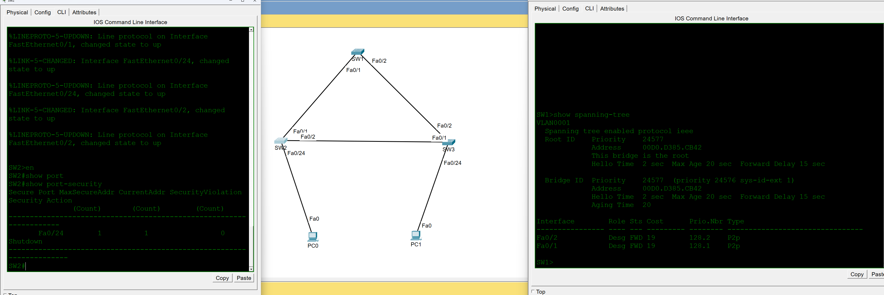

# STP & Port Security Lab

## Overview

This lab demonstrates Layer 2 redundancy and access-layer security using Spanning Tree Protocol (STP) and switch port security.

Three Cisco switches are connected in a redundant triangular topology. STP prevents Layer 2 switching loops by establishing a loop-free forwarding topology, while port security restricts access on end-device switch ports.

## Topology



### Devices

- 3 Cisco switches
- 2 client workstations
- Redundant switch-to-switch links
- Secured access ports for end devices

## Objectives

- Build a redundant Layer 2 switched topology
- Configure SW1 as the STP root bridge
- Verify STP port roles and forwarding states
- Prevent Layer 2 switching loops
- Configure port security on access ports
- Limit the number of permitted MAC addresses
- Configure shutdown behavior for security violations
- Verify STP and port-security operation using Cisco IOS commands

## Technologies

- Cisco IOS
- Spanning Tree Protocol (STP)
- Ethernet switching
- Root bridge selection
- STP port roles and states
- MAC address learning
- Port security
- Layer 2 network redundancy

## STP Implementation

The three switches are connected using redundant Layer 2 links.

Without STP, this physical topology could create a switching loop. STP establishes a loop-free logical topology while maintaining redundant physical connectivity.

SW1 was configured to become the root bridge.

Verification with:

```text
show spanning-tree
```

confirmed:

```text
This bridge is the root
```

For VLAN 1, SW1's FastEthernet0/1 and FastEthernet0/2 interfaces were operating as designated forwarding ports.

## Port Security

Port security was configured on the access port connecting an endpoint to SW2.

Verification showed the following configuration on FastEthernet0/24:

| Setting | Result |
|---|---|
| Maximum secure addresses | 1 |
| Current secure addresses | 1 |
| Security violations | 0 |
| Security action | Shutdown |

This configuration limits the access port to a single permitted MAC address and provides a mechanism for disabling the port if the configured security policy is violated.

## Verification

Cisco IOS commands used to verify the Layer 2 configuration include:

```text
show spanning-tree
show port-security
show port-security interface fa0/24
show mac address-table
show interfaces status
```

### Verified Results

STP verification confirmed that:

- SW1 was elected as the root bridge
- SW1 Fa0/1 was Designated / Forwarding
- SW1 Fa0/2 was Designated / Forwarding
- STP was active for VLAN 1

Port-security verification on SW2 confirmed:

- Fa0/24 was secured
- One MAC address was permitted
- One secure address was currently learned
- No security violations had occurred
- The configured violation action was Shutdown

## CLI Verification


The CLI output above demonstrates both successful STP root bridge selection and active port-security configuration.

## Skills Demonstrated

- Spanning Tree Protocol configuration
- STP root bridge selection
- STP port role analysis
- Layer 2 redundancy
- Switching loop prevention
- Port security configuration
- MAC address restrictions
- Security violation handling
- Cisco IOS verification commands
- Layer 2 troubleshooting
- Configure BPDU Guard on access ports to protect the STP topology from unexpected switch connections

## Lab File

The Cisco Packet Tracer topology is included in this directory:

`STP Port Security BPDU Guard.pkt`