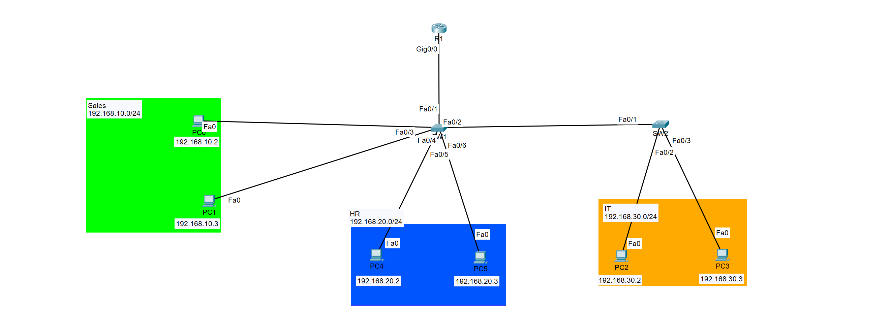

# VLAN & Inter-VLAN Routing Lab

## Overview

This lab demonstrates network segmentation using VLANs and inter-VLAN routing in a small multi-department Cisco network.

Sales, HR, and IT devices are separated into individual IP networks while a router provides Layer 3 connectivity between the networks.

## Topology



### Network Segments

| Department | Network | Example Hosts |
|---|---|---|
| Sales | 192.168.10.0/24 | 192.168.10.2, 192.168.10.3 |
| HR | 192.168.20.0/24 | 192.168.20.2, 192.168.20.3 |
| IT | 192.168.30.0/24 | 192.168.30.2, 192.168.30.3 |

## Objectives

- Segment departmental traffic using VLANs
- Configure switch access ports
- Configure trunk links between network devices
- Implement inter-VLAN routing
- Configure IP addressing and default gateways
- Verify connectivity within and between VLANs
- Troubleshoot Layer 2 and Layer 3 connectivity

## Technologies

- Cisco IOS
- VLANs
- IEEE 802.1Q trunking
- Router-on-a-stick
- IPv4 addressing
- Ethernet switching
- Inter-VLAN routing

## Implementation

Three logical networks were created for the Sales, HR, and IT departments.

End-device switch ports were assigned to their appropriate VLANs, while trunk links were used to carry VLAN traffic between network infrastructure devices.

Router R1 provides Layer 3 routing between the departmental networks using subinterfaces associated with the individual VLANs.

This allows the departments to remain logically segmented at Layer 2 while maintaining controlled Layer 3 connectivity between networks.

## Verification

Connectivity was verified using endpoint ping tests and Cisco IOS verification commands.

Useful verification commands include:

```text
show vlan brief
show interfaces trunk
show interfaces switchport
show ip interface brief
show running-config
```

End-to-end ping testing was used to verify both same-VLAN and inter-VLAN connectivity.

## Skills Demonstrated

- VLAN creation and administration
- Access port configuration
- 802.1Q trunk configuration
- Router subinterface configuration
- Inter-VLAN routing
- IPv4 network configuration
- Cisco IOS verification
- End-to-end connectivity testing
- Network troubleshooting

## Lab File

The Packet Tracer topology is included in this directory:

`Project 1 - Small Business.pkt`